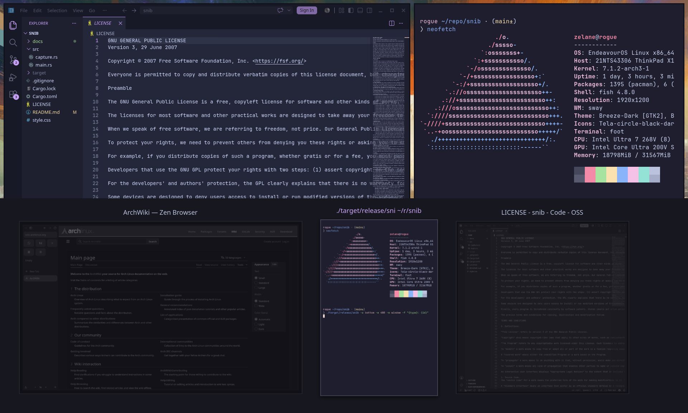

# snib

A thumbnail window/display picker for Wayland screen sharing, drawn as an
edge-anchored layer-shell bar. `snib` enumerates every capturable window and
output, grabs a live thumbnail of each, and lets you pick one with the mouse or
keyboard. The choice is printed to stdout, so it slots in as the chooser for
[`xdg-desktop-portal-wlr`](https://github.com/emersion/xdg-desktop-portal-wlr).



## Features

- Live thumbnails of both windows and displays, captured natively over a single
  Wayland connection.
- Occlusion-correct window capture via `ext-image-copy-capture-v1` driven
  straight from `ext-foreign-toplevel-list-v1` handles.
- Keyboard-driven: fuzzy-ish substring search, vi-style navigation, and
  one-key switching between the window and display lists.
- Anchor the bar to any screen edge (top/bottom → horizontal, left/right →
  vertical).
- Catppuccin Mocha theme built in, fully restylable with your own CSS and
  ready for `matugen` / `pywal` templating.

## Requirements

- A `wlroots`-based compositor (Sway, Hyprland, river, …) that implements
  `ext-foreign-toplevel-list-v1`, `ext-image-capture-source-v1`, and
  `ext-image-copy-capture-v1`.
- GTK 4.14+ and the `gtk4-layer-shell` library.

On Arch:

```sh
sudo pacman -S gtk4 gtk4-layer-shell
```

## Installation

```sh
cargo build --release
install -Dm755 target/release/snib ~/.local/bin/snib
```

## Usage

Run `snib` and it opens the picker bar. Select a source and its formatted line
is printed to stdout:

```sh
$ snib
Window: <toplevel-identifier>
```

### Keybindings

| Key        | Action                                  |
| ---------- | --------------------------------------- |
| `w`        | Show windows                            |
| `d`        | Show displays                           |
| `h` / `l`  | Move selection left / right             |
| `/`        | Open search                             |
| `Enter`    | Confirm the focused/first match         |
| `Esc`      | Close search, or cancel and exit        |

## Integrating with xdg-desktop-portal-wlr

`xdg-desktop-portal-wlr` runs a chooser command and reads the selected output's
name from stdout. Point it at `snib` in
`~/.config/xdg-desktop-portal-wlr/config`:

```ini
[screencast]
chooser_type=simple
chooser_cmd=snib
```

## Examples

```bash
# screenshot a specific window
grim -T $(snib -m window -f "{id}") window.png
# screenshot a specific display
grim -o $(snib -m display -f "{id}") display.png

# record the selected display
wf-recorder -o $(snib -m display -f "{id}") -f recording.mp4

# move focus to the selected app
swaymsg [app_id=$(snib -m window -f "{app_id}")] focus
```

## Configuration

Every flag has an environment-variable equivalent, so you can set defaults once
and override per-invocation.

| Flag                     | Env var             | Default        | Description                                         |
| ------------------------ | ------------------- | -------------- | --------------------------------------------------- |
| `-e, --edge <EDGE>`      | `SNIB_EDGE`         | `bottom`       | Screen edge to anchor to (`top`/`bottom`/`left`/`right`). |
| `-m, --mode <MODE>`      | `SNIB_MODE`         | `window`       | List shown on launch (`window`/`display`).          |
| `-w, --thumb-width <N>`  | `SNIB_THUMB_WIDTH`  | `320`          | Max thumbnail dimension in pixels (64–4096).        |
| `-s, --style <PATH>`     | `SNIB_STYLE`        | —              | Extra stylesheet layered over the built-in theme.   |
| `-f, --output-format <F>`| —                   | `{type}: {id}` | Line printed for the chosen source.                 |

The `--output-format` string supports the placeholders `{type}`, `{id}`,
`{caption}`, and `{app_id}`.

Set `SNIB_DEBUG=1` to print capture diagnostics to stderr.

## Theming

The built-in [`style.css`](style.css) is compiled into the binary. To restyle,
copy it and edit — the user file is loaded at a higher priority so its rules
win:

```sh
mkdir -p ~/.config/snib
cp style.css ~/.config/snib/style.css
```

`snib` loads, in increasing priority: the built-in theme, then
`~/.config/snib/style.css` (or `$XDG_CONFIG_HOME/snib/style.css`), then any file
passed via `--style`. The `@define-color` palette block at the top of the
stylesheet is a convenient target for `matugen` / `pywal` templates.

## License

[GPL-3.0-or-later](LICENSE).
